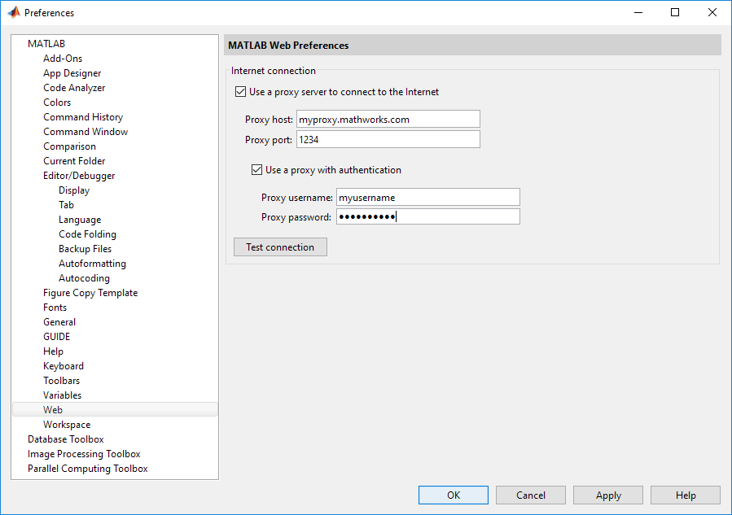

# Getting Started

Once this package is installed and authentication is in place one can begin working with S3™ and looking at simple workflows. The [Basic Usage](BasicUsage.md) document provides greater details on the functions being used in this first example. In this case, create and delete a bucket on S3. This example assumes that the bucket does not already exist.

```
% Create the client called s3 and initialize it to not use encryption when storing data
s3 = aws.s3.Client();
s3.useCredentialsProviderChain = false;
s3.initialize();

% create a bucket, note AWS provides naming guidelines
bucketName = 'com-myorg-mybucket';
s3.createBucket(bucketName);

% get a list of the buckets and see that com-myorg-mybucket appears
s3.listBuckets()

% cleanup by deleting the bucket and shutting down the client
s3.deleteBucket(bucketName);
s3.shutdown;
```

This should produce output similar to the following:
```
s3 = aws.s3.Client();
Creating Client

s3.initialize();
Initializing S3 client
Setting EncryptionScheme
Not using encryption

bucketName = 'com-myorg-my-test-bucket';
s3.createBucket(bucketName);
Creating bucket com-myorg-my-test-bucket

s3.listBuckets()

Listing buckets
         CreationDate                      Name                  Owner            OwnerId
 ______________________________  __________________________  _______________  _____________
 'Thu Mar 02 02:13:19 GMT 2017'  'com-example-testbucket'  'aws_test_dept'  '[REDACTED]'
 'Thu Jun 08 18:46:37 BST 2017'  'com-myorg-my-test-bucket'  'aws_test_dept'  '[REDACTED]'

s3.deleteBucket(bucketName);
Deleting bucket com-myorg-my-test-bucket

s3.shutdown;
Shutting down S3 client
```

## Logging
When getting started or debugging it can be helpful to get more feedback. Once the Client has been created one can set the logging level to verbose as follows:
```
logObj = Logger.getLogger();
logObj.DisplayLevel = 'verbose';
```
See: [Logging](Logging.md) for more details.


## Network proxy configuration

Many corporate networks require Internet access to take place via a proxy server. This includes the traffic between a MATLAB® session and Amazon's S3 servers.

Within the MATLAB environment one can specify the proxy settings using the web section of the preferences panel as shown:   
   
Here one can provide the server address and port as well as a username and password, if required.

In Windows one can also specify the proxy settings in Control Panel / Internet Options / Connections tab.

Other operating systems have similar network preference controls. Depending on one's network environment the proxy settings may also be configured automatically. However, by default the S3 Client will only use a proxy server once configured to do so. Furthermore a complex proxy environment may use different proxies for different traffic types and destinations.

One configures a proxy using the a ClientConfiguration object which is a property of the client. When the client is create if a proxy is configured in the MATLAB proxy configuration preferences then these values will be used and applied when the client is initialized. On Windows, were these not provided in the MATLAB preferences the Windows proxy settings would be used instead. Thus no intervention is required. However one can override the preferences and set proxy related values or reload values based on updated preferences. One can specify a specific proxy and port as follows. Note, this does not alter the settings in the MATLAB preferences panel.
```
s3.clientConfiguration.setProxyHost('proxyHost','myproxy.example.com');
s3.clientConfiguration.setProxyPort(8080);
```
The client is now configured to use the proxy settings given rather than those in the MATLAB preferences panel. In this case a username and password are not provided. They are normally not required for proxy access.

One can specify an automatic configuration URL as follows:
```
s3.clientConfiguration.setProxyHost('autoURL','https://examplebucket.amazonaws.com');
s3.clientConfiguration.setProxyPort('https://examplebucket.amazonaws.com');
```
This instructs the client to request a proxy port and host based on traffic to
https://examplebucket.amazonaws.com. Note, this is not the URL of the proxy itself. Different proxies may be in place to cover traffic to different addresses.

To use the username and password from the MATLAB preferences call:
```
s3.clientConfiguration.setProxyUsername();
s3.clientConfiguration.setProxyPassword();
```
Or to specify a username and password directly call:
```
s3.clientConfiguration.setProxyUsername('JoeProxyUser');
s3.clientConfiguration.setProxyPassword('2312sdsdes?$!%');
```

If a proxy server is being used, then the proxy values need to be configured as shown, this should be done with the client before initializing it for use.


[//]: #  (Copyright 2018 The MathWorks, Inc.)
